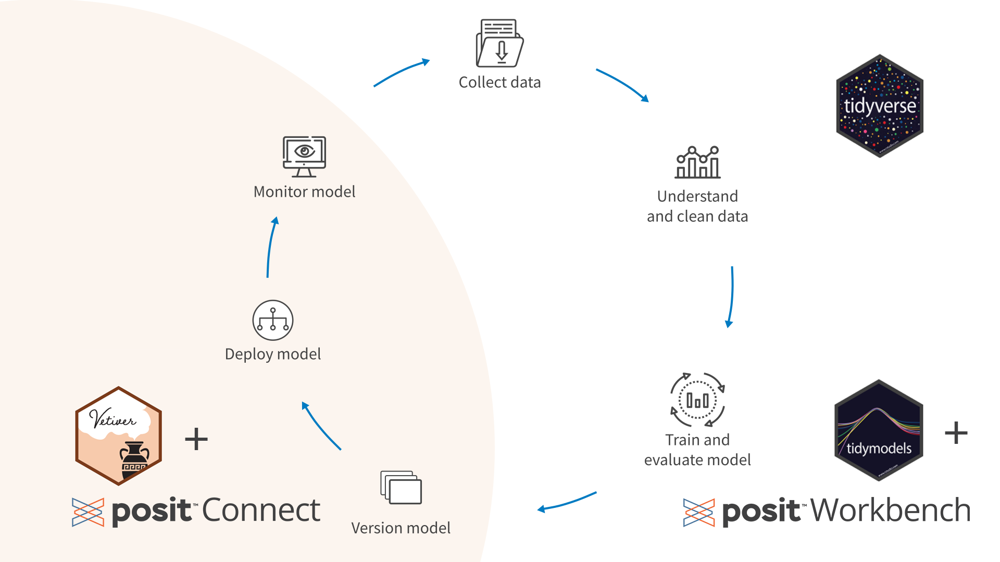

## An End-to-End Data Science Workflow

This repository contains source code demonstrating a tidymodels machine learning pipeline for prediction of drug mutagenicity. See the following links to learn more about different components of the analysis:

### Blog Post

A [post on the Posit Blog](https://posit.co/blog/pharmaceutical-machine-learning-with-tidymodels-and-posit-connect/) titled "Pharmaceutical machine learning with tidymodels and Posit Connect," where we walk through the model development process at a high level.

### Model Training Notebook

[Annotated source code](https://simonpcouch.github.io/mutagen/source/fit.html) to propose, fit, and evaluate a number of machine learning models.

### Slides

[Materials for a presentation](https://simonpcouch.github.io/mutagen/slides) at the Posit Team Demo series.

------------------------------------------------------------------------

### Repository Structure

-   `source/` contains scripts to propose, fit, and evaluate a number of machine learning models.
-   `slides/` contains Quarto source code for the linked slides.
-   `data/` contains summarized output from these scripts, for use in the write-up of the process.
-   `data-raw/` contains raw output from these scripts and is not tracked, as these files are quite large.

`index.html` contains unbranded source for the post on the Posit Blog.
